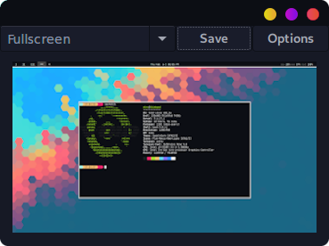

# Waysnip

Waysnip is a GUI screenshot tool for wayland. It's basically a frontend for grim and slurp. I always liked how the Microsoft Windows snipping tool displays your screenshot after you took one and wanted to have one on Linux.

This is roughly what it will look like.

## Dependencies

- grim
- slurp
- libglade
- gdk-pixbuf
- libgtk+3
